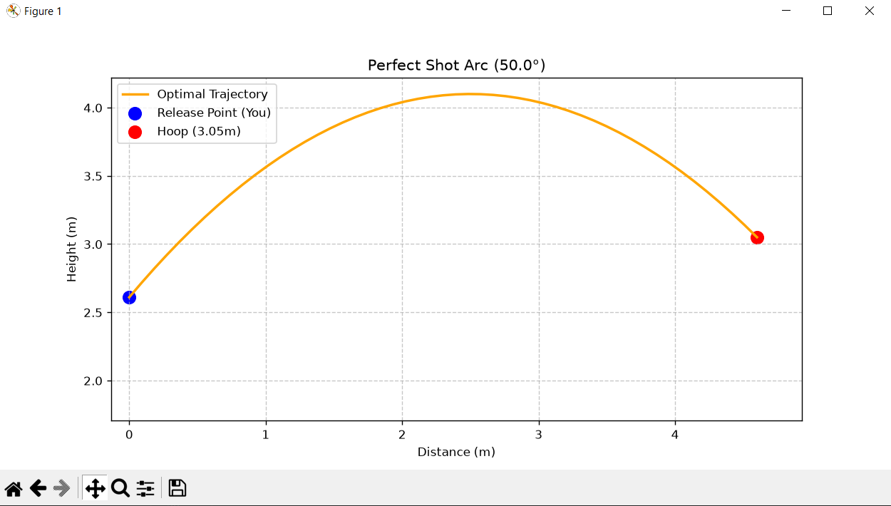

🏀 Basketball Shot Optimizer: Biomechanics & Kinematics
Overview
A physics-based Python tool that calculates the optimal release angle for a basketball shot. Unlike standard kinematic calculators that output initial velocity, this program focuses on practical biomechanics — determining the perfect launch angle based on the player's unique body metrics to achieve a perfect 45° entry angle into the hoop.
The Physics Engine
To eliminate the dependence on initial velocity (v_0) and time (t), I derived a custom mathematical model using the trajectory equation and its derivative.
Assuming the origin is the release point (0,0) and the hoop is at (L, \Delta y):
1. Trajectory Equation: y(x) = x \cdot \tan(\alpha) - \frac{g \cdot x^2}{2 \cdot v_0^2 \cdot \cos^2(\alpha)}
2. Derivative for Entry Angle: To achieve a 45° entry angle, the slope of the tangent at the hoop must be -1. \frac{dy}{dx} \Big|_{x=L} = \tan(\alpha) - \frac{g \cdot L}{v_0^2 \cdot \cos^2(\alpha)} = -1
3. Optimized Formula: By substituting and simplifying, we isolate the optimal angle: \tan(\alpha) = 1 + \frac{2 \cdot \Delta y}{L}
Features
- User-Specific Data: Calculates release point based on player height, arm reach, and vertical jump.
- Coach's Logic: Analyzes the output and provides actionable advice (e.g., "Shoot with a higher arc").
- Matplotlib Visualization: Generates a real-time, accurately scaled trajectory graph of the perfect shot.
Technologies Used
- Python 3
- math (Trigonometry and radian conversions)
- matplotlib (Data visualization)

